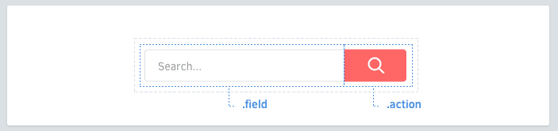

# Элементы

Элементы это части внутри вашего Компонента.



## Именование Элементов
Каждый Компонент может содержать Элементы. Они описываются классами в названии которых **одно слово**.

```scss
.search-form {
  > .field { /* ... */ }
  > .action { /* ... */ }
}
```

## Селекторы элемента
Лучше использовать `>` селектор потомка, где это возможно. Это препятствует просачиванию во вложенные компоненты, и производительней, чем последовательные селекторы.

```scss
.article-card {
  .title     { /* так можно */ }
  > .author  { /* ✓ так лучше */ }
}
```

## Несколько слов
Для тех, кому нужно два и более слов в названии элемента, объедините их без дефисов или подчёркиваний.

```scss
.profile-box {
  > .firstname { /* ... */ }
  > .lastname { /* ... */ }
  > .avatar { /* ... */ }
}
```

## Избегайте селекторов по тегу
Используйте имена классов, где это возможно. Селекторы по тегу прекрасны, но они могут снизить эффективность и могут быть малоинформативны.

```scss
.article-card {
  > h3    { /* ✗ избегайте подобного */ }
  > .name { /* ✓ так лучше */ }
}
```

Не только лишь все элементы могут выглядеть одинаково. Варианты помогут с этим.
[Далее →](variants.md)
<!-- {p:.pull-box} -->
