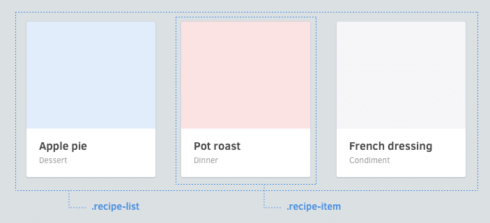

# Слои



## Избегайте позиционируемых свойств
Компоненты сделаны таким способом, чтобы использоваться в различном контексте. Избегайте помещения следующих свойств в Компоненты:

  * Позиционирование (`position`, `top`, `left`, `right`, `bottom`)
  * Флоаты (`float`, `clear`)
  * Внешние отступы (`margin`)
  * Размеры (`width`, `height`) *

## Фиксированные размеры

Исключением могут быть Элементы с фиксированной шириной/высотой, такие как аватары или лого.

## Установка позиционирования в родителях

Если нужно установить что-то из четырёх свойств, приведённых выше, делайте это в любом контексте, в котором расположен Компонент. В примере ниже, заметьте, что ширина и флоаты установлены внутри Компонента *список статей*, а не к самому Компоненту статьи.

  ```css
  .article-list {
    & {
      @include clearfix;
    }

    > .article-card {
      width: 33.3%;
      float: left;
    }
  }

  .article-card {
    & { /* ... */ }
    > .image { /* ... */ }
    > .title { /* ... */ }
    > .category { /* ... */ }
  }
  ```

Как применить отступы снаружи Слоя? Попробуйте Помощников.
[Далее →](helpers.md)
<!-- {p:.pull-box} -->
