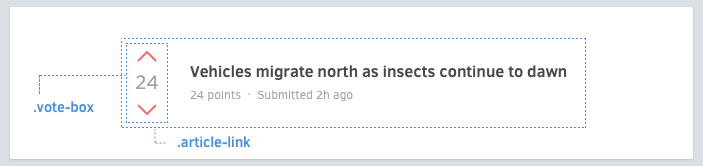

# Вложенные Компоненты



```html
<div class='article-link'>
  <div class='vote-box'>
    ...
  </div>
  <h3 class='title'>...</h3>
  <p class='meta'>...</p>
</div>
```

Иногда необходимы вложенные Компоненты. Ниже есть несколько способов, как это сделать.

## Варианты
Компонент нужно изменить, когда он вложен в другой Компонент. Вместо дописывания Варианта к цепочке вложенных Компонентов, сделайте это непосредственно с нужным Компнентом.

```scss
.article-header {
  > .vote-box > .up { /* ✗ избегайте подобного */ }
}
```

  Вместо этого, лучше добавить Вариант ко вложенному Компоненту и применить это к родительскому Кмопоненту.

```html
<div class='article-header'>
  <div class='vote-box -highlight'>
    ...
  </div>
  ...
</div>
```

```scss
.vote-box {
  &.-highlight > .up { /* ... */ }
}
```

## Упрощение вложенных Компонентов
Иногда, когда есть вложенные Компоненты, разметка может загрязняться:

```html
<div class='search-form'>
  <input class='input' type='text'>
  <button class='search-button -red -large'></button>
</div>
```

Это можно упростить, используя механизм препроцессора CSS `@extend`:

```html
<div class='search-form'>
  <input class='input' type='text'>
  <button class='submit'></button>
</div>
```

```scss
.search-form {
  > .submit {
    @extend .search-button;
    @extend .search-button.-red;
    @extend .search-button.-large;
  }
}
```

Что насчёт повотряющихся Элементов, таких как списки? Узнаем о Слоях.
[Далее →](layouts.md)
<!-- {p:.pull-box} -->
