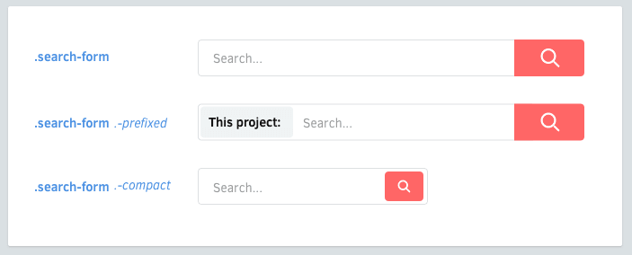

# Варианты

Компоненты могут иметь Варианты. Элементы тоже могут иметь Варианты.



<br>

## Именование Вариантов
Названия классов для Вариантов должны быть с префиксом в виде дефиса (`-`).

  ```scss
  .like-button {
    &.-wide { /* ... */ }
    &.-short { /* ... */ }
    &.-disabled { /* ... */ }
  }
  ```

## Варианты Элементов
Элементы также могут иметь Варианты.

  ```scss
  .shopping-card {
    > .title { /* ... */ }
    > .title.-small { /* ... */ }
  }
  ```

## Перфикс в виде дефиса
Дефисы это предпочитаемый префикс для Вариантов.

  * Это предотвращает схожесть с Элементами.
  * Класс CSS может начинаться только с буквы, `_` или `-`.
  * Дефисы проще печатать, чем нижние подчёркивания.
  * Немного напоминает опции в UNIX командах (`gcc -O2 -Wall -emit-last`).

Как справиться со сложными Компонентами? Вложите их друг в друга.
[Далее →](nested-components.md)
<!-- {p:.pull-box} -->
